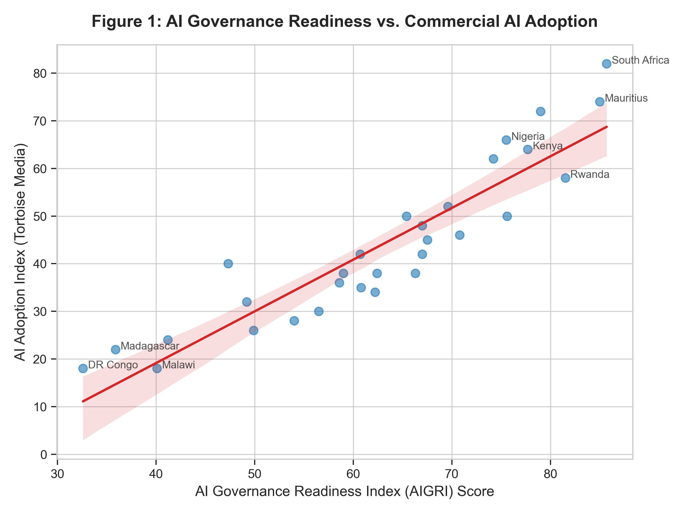
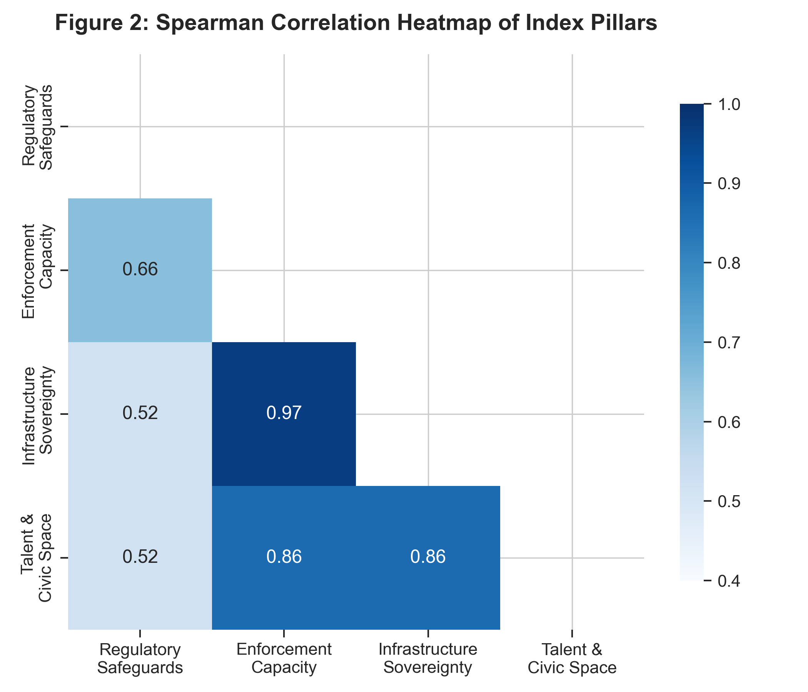
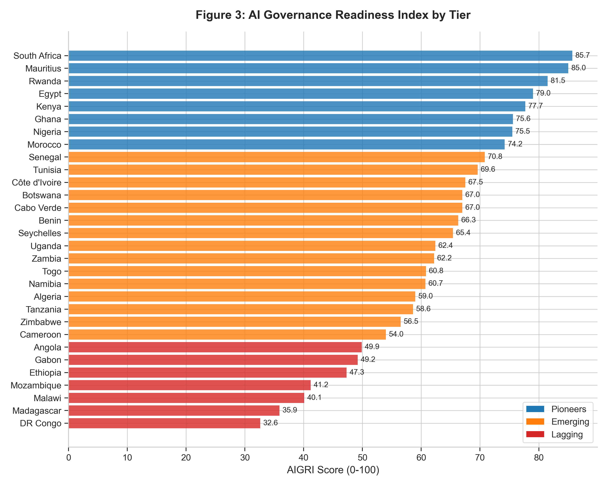

# Measuring AI Governance Readiness in Africa: A Principal Component–Based Index of Safety and Ethics

**Abstract:**  
As artificial intelligence (AI) systems rapidly propagate globally, evaluating governmental capacity to govern these technologies safely and ethically is a paramount policy challenge. Existing global indices often emphasize commercial adoption while ignoring the critical dimensions of safety oversight, data protection, and digital sovereignty in the Global South. To address this gap, this paper introduces the **AI Governance Readiness Index for Africa (AIGRI)**. AIGRI evaluates 30 African nations using 16 indicators across four pillars, explicitly including civic space and linguistic sovereignty. Utilizing Principal Component Analysis (PCA) to check indicator balance and inform weighting, we categorize countries into three distinct tiers: Pioneers, Emerging, and Lagging. We find evidence that AIGRI is strongly associated with commercial AI adoption ($N=30$, Spearman $\rho = 0.935$). A multivariate OLS regression reveals that regulatory readiness remains strongly associated with adoption even after controlling for national wealth. Finally, we present a case study on Nigeria, demonstrating how the nation can leverage its legislative foundations to bridge infrastructural gaps. AIGRI is designed as a governance and rights-focused complement to existing AI readiness indices, not as a measure of overall AI capability.

**Keywords:** AI Governance, AI Safety & Ethics, Composite Index, Principal Component Analysis (PCA), Digital Sovereignty, Regulatory State Capacity, Decolonial AI, Socio-Technical Imaginaries, African Union.

---

## 1. Introduction

The rapid evolution of generative AI and foundation models has accelerated changes in global technology governance. While major regulatory regimes in the Global North—most notably the European Union’s AI Act (European Union, 2024) and the United States' Executive Order on Safe, Secure, and Trustworthy AI (Executive Office of the President, 2023)—actively shape international standard-setting, the unique regulatory, infrastructural, and socio-political realities of African nations are systematically marginalized. Standard global metrics, such as Oxford Insights’ Government AI Readiness Index (Oxford Insights, 2025) or the Tortoise Global AI Index (Tortoise Media, 2025), penalize Global South nations for lacking venture-backed startup ecosystems or large-scale cloud data centers. In doing so, they obscure crucial domestic progress in data protection legislation, institutional oversight, and indigenous socio-technical resistance.

Crucially, there is no standard, context-specific metric assessing **readiness for AI safety and ethics** across the African continent, despite the proliferation of global ethics guidelines (Floridi et al., 2018; Hagendorff, 2020; Jobin et al., 2019). Governance readiness in Africa cannot be defined purely as the capacity to build or procure commercial algorithms, nor simply mapped to broad continental strategies like the AU Digital Transformation Strategy (African Union, 2020). Instead, it must be evaluated through a multi-dimensional framework encompassing legal safeguards, regulatory enforcement, computational and linguistic sovereignty, and democratic civic space. In the absence of localized indicators, policymakers are left with inappropriate benchmarks that encourage extractive regulatory copying. For instance, directly transplanting GDPR-style regulations without funding the corresponding enforcement agencies creates compliance burdens without actual data protection.

This paper addresses this gap by making the following contributions:
1. We construct the **AI Governance Readiness Index (AIGRI)** across 16 indicators and demonstrate its robustness.
2. We derive a governance typology that classifies 30 African states into three actionable policy tiers.
3. We explore the association between governance readiness and technological adoption, controlling for income.
4. We provide a case study of Nigeria and outline concrete policy implications.

---

## 2. Literature Review: Existing AI Readiness Indices

The proliferation of global AI readiness indices has established a baseline for international comparison, yet these frameworks frequently fail to capture the nuances of governance in the Global South. Three dominant models illustrate this methodological gap: the Oxford Insights Government AI Readiness Index, the Tortoise Global AI Index, and the Stanford HAI AI Index.

**The Oxford Insights Government AI Readiness Index** evaluates governments based on three pillars: Government, Tech Sector, and Data & Infrastructure (Oxford Insights, 2025). While its Government pillar captures essential public sector agility, its Tech Sector metrics heavily penalize African nations. Indicators such as the number of AI unicorns, venture capital availability, and the volume of GitHub repositories heavily skew the index toward established Global North ecosystems. Consequently, countries with robust regulatory frameworks but nascent commercial tech sectors are consistently ranked as unprepared.

**The Tortoise Global AI Index** similarly emphasizes commercial capacity, relying heavily on private investment, commercial adoption, and high-end talent metrics (Tortoise Media, 2025). This approach measures current industrial AI capability rather than the *readiness to govern* future AI deployments. In an African context, where many countries will be net importers of foundational models, measuring governance readiness via the volume of domestic AI patents or billion-dollar startups misrepresents Global South readiness as a mere lack of capital, obscuring critical progress in data protection and institutional oversight.

**The Stanford HAI AI Index** provides an expansive global lens on AI trends, encompassing research and development, technical performance, and policy (Maslej et al., 2025). However, its policy tracking often focuses on high-level national strategies or major legislative acts (like the EU AI Act), lacking granularity on the foundational regulatory architectures necessary in emerging markets—such as the operational status of Data Protection Authorities or local data residency requirements.

**The AIGRI Contribution:** AIGRI diverges fundamentally from these frameworks by divorcing *governance readiness* from *commercial AI capability*. By prioritizing regulatory capacity, enforcement mechanisms, computational and linguistic sovereignty, and civic space, AIGRI offers a contextualized assessment. It acknowledges that for many African nations, readiness is not about building the next foundational model, but about establishing the sovereign, ethical, and legal frameworks necessary to safely integrate and govern imported AI technologies.

---

## 3. Theoretical Framework

To ground the index in established theory, we build our framework on three intersecting bodies of social and political theory:

### A. Regulatory State Capacity (Majone, 1997; Braithwaite, 2008)
In political science, regulatory capacity is defined as the ability of a state to formulate, implement, and enforce rule-based standards. Majone (1997) distinguishes between the *redistributive state* and the *regulatory state*. Under resource constraints, many African states are transitioning directly into regulatory states regarding technology—relying on rule-making rather than direct capital injection. However, a major theoretical tension exists between *de jure* capacity (laws written on paper) and *de facto* enforcement capacity (active regulators with budgets, expertise, and political independence). Braithwaite’s (2008) model of "responsive regulation" highlights that enforcement fails when regulatory agencies lack the technical capacity to evaluate complex systems, leading to administrative capture. This implies that a governance readiness index for Africa must include enforcement capacity (Pillar 2), which we operationalize through indicators like active Data Protection Authorities and independent safety bodies.

### B. Decolonial AI & Digital Sovereignty (Mohamed et al., 2020)
A critical critique of Western-centric AI safety indices is their alignment with what could be termed *digital neo-colonialism*. Large Language Models (LLMs) trained primarily on Western datasets risk reinforcing cognitive biases and linguistic exclusion. Mohamed, Png, and Isaac (2020) outline how the Global South is often treated as a source of cheap raw data and low-paid moderation labor (e.g., content moderation in Kenya) while importing finished algorithmic models. **Computational and Linguistic Sovereignty** represents the theoretical and physical defense against this extraction. Achieving sovereignty requires local cloud hosting (data residency), active engagement in regional frameworks (such as the African Union’s Malabo Convention), and the support of localized NLP datasets (e.g., the Masakhane grassroots research project) to represent indigenous languages (Yoruba, Swahili, Amharic, etc.) in generative architectures. This implies that a governance readiness index for Africa must include computational and linguistic sovereignty (Pillar 3), which we operationalize via local datacenter capacity and indigenous NLP resources.

### C. Socio-Technical Imaginaries (Jasanoff & Kim, 2015)
Socio-technical imaginaries are "collectively held, institutionally stabilized, and publicly performed visions of desirable futures, animated by shared understandings of forms of social life and social order attainable through, and supportive of, advances in science and technology" (Jasanoff & Kim, 2015). Across Africa, countries perform different socio-technical imaginaries:
* **The Service/Development Hub (e.g., Rwanda, Mauritius):** Positioned around high regulatory efficiency, ease of doing business, and state-directed tech deployment. As shown later in our results, these countries score highly in Pillar 1, reflecting strong state direction.
* **The Tech-Entrepreneurial Ecosystem (e.g., Nigeria, Kenya, South Africa):** Animated by vibrant private-sector innovation, startup funding, and grassroots tech hubs, often outpacing state legislative agility.
* **The Sovereign Security State (e.g., Egypt):** Focussing heavily on cyber-defense, national strategy coordination, and institutional control. This implies that a governance readiness index for Africa must include civic space and talent (Pillar 4), which we operationalize via digital liberties and education metrics, to capture the varying openness of these ecosystems.

---

## 4. Data & Methodology

### A. Country Selection & Indicator Compilation
We compiled a highly balanced dataset of 30 African nations representing the continent’s economic and cultural diversity, chosen based on data availability across all major global databases. Small island states or conflict zones with severe missing data were excluded. Each country was scored on a standard $0$ to $10$ or $0$ to $100$ scale across 16 indicators representing the four core pillars.

The indicators were compiled from a variety of authoritative public data sources, public registries, and legislative trackers. Pillar 1 (Regulatory Safeguards) data is derived from the UNCTAD Cyberlaw Tracker (UNCTAD, 2025), the OECD AI Policy Observatory (OECD, 2025), and the African Union's official treaty status records for the Malabo Convention (African Union, 2014), supplemented by desk coding of national gazettes such as the Nigeria Data Protection Act (Federal Republic of Nigeria, 2023). Pillar 2 (Enforcement Capacity) scores are compiled via systematic desk coding of national Data Protection Authorities' active portals, public strategy documents, ISO member listings, and national standards bureau directories (OECD, 2025). Pillar 3 (Computational & Linguistic Sovereignty) integrates infrastructure data from the Cloudscene Data Center Directory (Cloudscene, 2025), the ITU World Telecommunication/ICT Indicators Database (International Telecommunication Union, 2024a), the ITU Global Cybersecurity Index (International Telecommunication Union, 2024b), and localized NLP resources cataloged by the Masakhane NLP initiative (Orife et al., 2020). Pillar 4 (Talent & Civic Space) draws on higher education and STEM enrollment datasets from the UNESCO Institute for Statistics (UNESCO Institute for Statistics, 2024), digital literacy indicators from the ITU Digital Development Dashboard (International Telecommunication Union, 2024a), and democratic civil liberties metrics from the Varieties of Democracy project's Digital Society Survey (V-Dem Institute, 2024).

For econometric validation, macro-developmental proxy variables were also compiled, including gross domestic product (GDP) per capita from the World Bank World Development Indicators (World Bank, 2025), commercial AI adoption and private investment statistics from the Tortoise Global AI Index (Tortoise Media, 2025) and the Stanford Human-Centered AI Index (Maslej et al., 2025), and structural ICT access scores from the ITU ICT Development Index (International Telecommunication Union, 2024c).

### B. Composite Index Mathematics
To check whether the data support balanced weighting and inform robustness analysis, we adhere strictly to the joint OECD/JRC Handbook on Constructing Composite Indicators (OECD/EC JRC, 2008):

#### 1. Normalization
Indicators are normalized using a universal Min-Max scale mapped onto a $[0, 100]$ range:
$$x_{norm} = \frac{x - x_{min}}{x_{max} - x_{min}} \times 100$$
where $x_{min}$ and $x_{max}$ are set to the theoretical maximum bounds of the indicators (e.g., 0 and 10 for ordinal policy indicators; 0 and 100 for percentage indexes). We chose theoretical bounds over empirical min-max bounds to preserve absolute developmental differences, rather than artificially stretching relative scores. In cases where raw values exceed the theoretical upper bound (e.g., ITU fixed-broadband subscriptions can exceed 100 per 100 inhabitants due to multiple subscriptions per household), normalized values are capped at 100.

#### 2. Statistical Weighting via Principal Component Analysis (PCA)
Let $P$ represent the $N \times 4$ standardized matrix of the four pillar scores. The covariance matrix $C$ is computed as:
$$C = \frac{1}{N-1} P^T P$$
We execute an eigenvalue decomposition on $C$:
$$C v = \lambda v$$
where $\lambda$ represents the eigenvalues and $v$ represents the eigenvectors (loadings). The first principal component (PC1) corresponds to the largest eigenvalue $\lambda_1$. The statistical weights $w_j$ for each pillar $j$ are derived by taking the normalized absolute loadings of PC1:
$$w_j = \frac{|v_{1, j}|}{\sum_{k=1}^4 |v_{1, k}|}$$

#### 3. Mathematical Cluster Analysis
We apply a 1D K-Means clustering algorithm on the final index scores to group countries into three homogenous tiers for interpretable policy use: Pioneers, Emerging, and Lagging.
Points are assigned to the nearest centroid, and centroids are iteratively updated until convergence:
$$\mu_k^{(t+1)} = \frac{1}{|S_k^{(t)}|} \sum_{x_i \in S_k^{(t)}} x_i$$
We then sort the cluster labels dynamically by their mean index score to ensure intuitive ordinal interpretation.

### C. Data Sources & Temporal Coverage
To ensure academic rigor, reproducibility, and transparency, Table 2 compiles the metadata for each of the 16 structural indicators and 4 validation variables. In compliance with data provenance standards, the table specifies the source organization, the underlying publication or tracker, the database edition, the exact date of retrieval (which was conducted in May 2026 to ensure the most modern, up-to-date figures are utilized), and the corresponding reference key in our bibliography.

| Indicator ID | Pillar / Category | Source Organization | Primary Publication / Dataset | Edition / Year | Retrieval Date | Reference Key |
| :--- | :--- | :--- | :--- | :---: | :---: | :--- |
| **Pillar 1 Indicators** | | | | | | |
| `data_protection` | Regulatory Safeguards | UNCTAD | Cyberlaw Tracker: Data Protection Worldwide | 2025 | May 21, 2026 | `unctad2025cyberlaw` |
| `ai_strategy` | Regulatory Safeguards | OECD | OECD AI Policy Observatory - AI Strategies | 2025 | May 21, 2026 | `oecdai2025observatory` |
| `cybercrime_law` | Regulatory Safeguards | UNCTAD | Cyberlaw Tracker: Cybercrime Legislation | 2025 | May 21, 2026 | `unctad2025cyberlaw` |
| `malabo_ratification` | Regulatory Safeguards | African Union | AU Treaty Status - Malabo Convention | 2025 | May 21, 2026 | `africanunion2014malabo` |
| **Pillar 2 Indicators** | | | | | | |
| `dpa_active` | Enforcement Capacity | National Governments | Active Data Protection Authority Portals | 2025 | May 21, 2026 | Desk Coding |
| `ai_safety_body` | Enforcement Capacity | OECD / Govts | National AI Strategy & Policy Documents | 2025 | May 21, 2026 | `oecdai2025observatory` |
| `standards_agency` | Enforcement Capacity | ISO / NSBs | ISO Member Directory & NSB Portals | 2025 | May 21, 2026 | Desk Coding |
| `ethical_review` | Enforcement Capacity | National Governments | Academic and Government Ethics Frameworks | 2025 | May 21, 2026 | Desk Coding |
| **Pillar 3 Indicators** | | | | | | |
| `local_datacenters` | Infrastructure Sovereignty | Cloudscene | Global Data Center Directory | 2025 | May 21, 2026 | `cloudscene2025directory` |
| `broadband_penetration` | Infrastructure Sovereignty | ITU | World Telecommunication/ICT Indicators (WTID) | 2024 | May 21, 2026 | `itu2024wtid` |
| `localized_nlp` | Infrastructure Sovereignty | Masakhane | Grassroots African NLP Resource Tracker | 2025 | May 21, 2026 | `orife2020masakhane` |
| `cybersecurity_index` | Infrastructure Sovereignty | ITU | Global Cybersecurity Index (GCI) | 2024 | May 21, 2026 | `itu2024gci` |
| **Pillar 4 Indicators** | | | | | | |
| `ai_education` | Talent & Civic Space | UNESCO | Institute for Statistics & University Desk Coding | 2025 | May 21, 2026 | `unesco2024stem` |
| `digital_literacy` | Talent & Civic Space | ITU / World Bank | Digital Development Dashboard / DAI | 2024 | May 21, 2026 | `itu2024wtid` |
| `civic_space_index` | Talent & Civic Space | V-Dem Institute | Varieties of Democracy Dataset v14 | 2024 | May 21, 2026 | `vdem2024dataset` |
| `gender_stem` | Talent & Civic Space | UNESCO | STEM Enrollment by Gender Statistics | 2024 | May 21, 2026 | `unesco2024stem` |
| **Validation Variables** | | | | | | |
| `gdp_per_capita` | Economic Proxy | World Bank | World Development Indicators (WDI) | 2025 | May 21, 2026 | `worldbank2025wdi` |
| `ai_adoption_index` | Adoption Proxy | Tortoise Media | The Global AI Index | 2025 | May 21, 2026 | `tortoise2025globalai` |
| `ai_investment_usd` | Investment Proxy | Stanford HAI | The AI Index Annual Report | 2025 | May 21, 2026 | `maslej2025aiindex` |
| `ict_development` | Infrastructure Proxy | ITU | ICT Development Index (IDI) | 2024 | May 21, 2026 | `itu2024idi` |

All code and indicator data used to construct AIGRI are available in the accompanying replication repository.

---

## 5. Empirical Results & Analysis

### A. Index Scores, Rankings & Cluster Tiers
We successfully compiled the weights and scores for the 30 countries. The results are summarized below:

| Rank | Country | Region | Pillar 1 (Reg) | Pillar 2 (Enf) | Pillar 3 (Inf) | Pillar 4 (Tal) | EWI Score | PCA Score | Cluster Tier |
| :--- | :--- | :--- | :---: | :---: | :---: | :---: | :---: | :---: | :--- |
| 1 | South Africa | South | 82.5 | 80.0 | 96.8 | 83.0 | 85.6 | 85.7 | Pioneers |
| 2 | Mauritius | East | 100.0 | 80.0 | 83.8 | 78.8 | 85.6 | 85.0 | Pioneers |
| 3 | Rwanda | East | 100.0 | 82.5 | 78.0 | 68.0 | 82.1 | 81.5 | Pioneers |
| 4 | Egypt | North | 87.5 | 77.5 | 88.5 | 63.5 | 79.3 | 79.0 | Pioneers |
| 5 | Kenya | East | 85.0 | 67.5 | 86.7 | 73.0 | 78.0 | 77.7 | Pioneers |
| 6 | Ghana | West | 95.0 | 65.0 | 76.5 | 69.0 | 76.4 | 75.6 | Pioneers |
| 7 | Nigeria | West | 87.5 | 70.0 | 81.9 | 64.5 | 76.0 | 75.5 | Pioneers |
| 8 | Morocco | North | 85.0 | 70.0 | 80.2 | 63.0 | 74.6 | 74.2 | Pioneers |
| 9 | Senegal | West | 95.0 | 60.0 | 72.0 | 60.0 | 71.7 | 70.8 | Emerging |
| 10 | Tunisia | North | 80.0 | 60.0 | 74.7 | 65.5 | 70.0 | 69.6 | Emerging |
| 11 | Côte d'Ivoire | West | 92.5 | 55.0 | 69.2 | 57.5 | 68.5 | 67.5 | Emerging |
| 12 | Botswana | South | 77.5 | 55.0 | 70.4 | 67.2 | 67.5 | 67.0 | Emerging |
| 13 | Cabo Verde | West | 90.0 | 52.5 | 63.7 | 66.0 | 68.0 | 67.0 | Emerging |
| 14 | Benin | West | 95.0 | 55.0 | 63.3 | 56.5 | 67.5 | 66.3 | Emerging |
| 15 | Seychelles | East | 77.5 | 52.5 | 65.2 | 68.8 | 66.0 | 65.4 | Emerging |
| 16 | Uganda | East | 77.5 | 52.5 | 67.0 | 55.0 | 63.0 | 62.4 | Emerging |
| 17 | Zambia | South | 90.0 | 47.5 | 60.1 | 56.0 | 63.4 | 62.2 | Emerging |
| 18 | Togo | West | 92.5 | 47.5 | 56.1 | 52.5 | 62.1 | 60.8 | Emerging |
| 19 | Namibia | South | 75.0 | 42.5 | 63.0 | 65.2 | 61.4 | 60.7 | Emerging |
| 20 | Algeria | North | 77.5 | 47.5 | 65.2 | 48.8 | 59.7 | 59.0 | Emerging |
| 21 | Tanzania | East | 75.0 | 47.5 | 62.8 | 52.0 | 59.3 | 58.6 | Emerging |
| 22 | Zimbabwe | South | 87.5 | 40.0 | 56.9 | 47.0 | 57.9 | 56.5 | Emerging |
| 23 | Cameroon | Central | 87.5 | 35.0 | 53.7 | 45.5 | 55.4 | 54.0 | Emerging |
| 24 | Angola | Central | 85.0 | 32.5 | 49.1 | 38.8 | 51.4 | 49.9 | Lagging |
| 25 | Gabon | Central | 72.5 | 32.5 | 50.4 | 45.5 | 50.2 | 49.2 | Lagging |
| 26 | Ethiopia | East | 50.0 | 37.5 | 59.8 | 42.5 | 47.5 | 47.3 | Lagging |
| 27 | Mozambique | East | 55.0 | 27.5 | 44.3 | 40.5 | 41.8 | 41.2 | Lagging |
| 28 | Malawi | East | 52.5 | 22.5 | 42.6 | 45.2 | 40.7 | 40.1 | Lagging |
| 29 | Madagascar | East | 40.0 | 22.5 | 41.2 | 41.2 | 36.2 | 35.9 | Lagging |
| 30 | DR Congo | Central | 35.0 | 20.0 | 41.6 | 34.5 | 32.8 | 32.6 | Lagging |

*(Table 1: Final AIGRI rankings and scores for all 30 evaluated countries).*

The full 30-country ranking reveals distinct regional patterns in AI governance readiness across the African continent:

**East and South Africa’s Dominance:** Nations such as South Africa, Mauritius, Rwanda, and Kenya dominate the Pioneer tier. This performance is driven by a powerful synergy: strong computational infrastructure (Pillar 3) combined with highly agile policymaking (Pillar 1). South Africa and Mauritius, in particular, benefit from significant data center investments and active regulatory enforcement mechanisms, positioning them as regional anchors for AI governance. Rwanda’s presence at the top underscores how decisive state-led digital transformation strategies can compensate for smaller market sizes.

**West Africa’s Regulatory Push:** West African nations, notably Nigeria, Ghana, and Senegal, show strong *de jure* performance, scoring exceptionally high in Regulatory Safeguards (Pillar 1). These countries have been proactive in drafting national AI strategies, enacting data protection laws, and engaging with frameworks like the Malabo Convention. However, their overall rankings are frequently pulled down by enforcement gaps (Pillar 2). The challenge in West Africa is transitioning from drafting comprehensive legislation to funding and empowering the agencies required to enforce it.

**Central Africa’s Lag:** The Lagging tier is heavily populated by Central African states, including Cameroon, Angola, Gabon, and the DR Congo. This clustering correlates with broader institutional and infrastructural challenges. These nations generally score poorly across all four pillars, characterized by an absence of dedicated AI strategies, dormant or non-existent data protection authorities, and severe deficits in sovereign computational infrastructure. This regional lag highlights a critical area requiring targeted capacity-building interventions from the African Union.

### B. Analysis of PCA Weights
PC1 explains 84.20% of the variance across the four pillars, supporting a one-dimensional composite score. The derived statistical weights are:
* **Pillar 1 (Regulatory Safeguards):** 21.79%
* **Pillar 2 (Enforcement Capacity):** 26.73%
* **Pillar 3 (Infrastructure Sovereignty):** 26.09%
* **Pillar 4 (Talent & Civic Space):** 25.39%

The weights are highly balanced, showing that institutional enforcement capacity (26.73%) and infrastructure/linguistic sovereignty (26.09%) are slightly more statistically informative in explaining variance across countries than de jure regulations alone.

### C. Econometric Validation
We performed correlation and regression analyses using proxy macro-variables to validate the index ($N=30$):
1. **AI Adoption Index:** Pearson $r = 0.917$ ($p < 0.001$), Spearman $\rho = 0.935$ ($p < 0.001$).
2. **ICT Development Index:** Pearson $r = 0.834$ ($p < 0.001$), Spearman $\rho = 0.804$ ($p < 0.001$).
3. **AI Investment (USD Millions):** Pearson $r = 0.611$ ($p < 0.001$), Spearman $\rho = 0.811$ ($p < 0.001$).

*(Figure 1: Scatter plot demonstrating the strong positive relationship between AIGRI scores and commercial AI adoption. N=30. Regression equation: y = -36.40 + 1.012x + 2.16z, R² = 0.849).*

#### Multivariate OLS Regression Model
To test whether regulatory readiness is not merely a proxy for national wealth, we estimated the following OLS equation:
$$\text{AI Adoption} = -36.40 + 1.012 \cdot \text{AIGRI} + 2.16 \cdot \log(\text{GDP per capita})$$

The coefficient for AIGRI ($\beta_1 = 1.012$, $SE = 0.105$, $t = 9.622$, $p < 0.001$) indicates that for every 1-point increase in our governance index, commercial AI adoption increases by approximately 1.01 points, independent of GDP. The control for national wealth ($\beta_2 = 2.158$, $SE = 1.656$, $t = 1.303$, $p = 0.2037$) indicates that governance readiness remains strongly associated with adoption in this model. The model captures a substantial portion of variance ($R^2 = 0.849$, Adjusted $R^2 = 0.838$). This is consistent with the hypothesis that better governance readiness is associated with higher AI adoption, even after accounting for income levels, although causal directions cannot be inferred from cross-sectional data.

### D. Sensitivity Analysis & Weighting Robustness

*(Figure 2: Correlation heatmap demonstrating positive alignment across all four governance pillars).*

To evaluate the mathematical stability and structural robustness of the AIGRI composite index, we conducted a comprehensive sensitivity analysis under three distinct weighting designs, in accordance with best practices in index construction (OECD/EC JRC, 2008):
1. **PCA-Weighted Framework (AIGRI_PCA):** The primary index using weights derived mathematically from the loadings of the first principal component (PC1).
2. **Equal-Weighted Framework (AIGRI_EWI):** An alternative specification where each of the four pillars is allocated a static weight of 25.00%.
3. **Infrastructure-Dropped Specification (AIGRI_NoInfra):** A targeted structural test that computes equal weights over only Pillars 1, 2, and 4 (Regulatory Safeguards, Enforcement Capacity, and Talent & Civic Space), entirely omitting Pillar 3 (Infrastructure Sovereignty) to isolate institutional and human capital readiness.

Country rankings and tier assignments are remarkably stable across all weighting schemes. We calculated the pairwise Spearman rank correlations between all country rankings produced under these three specifications:
* **Spearman $\rho$ (PCA vs. EWI):** **0.9987**
* **Spearman $\rho$ (PCA vs. Infrastructure-Dropped):** **0.9879**
* **Spearman $\rho$ (EWI vs. Infrastructure-Dropped):** **0.9914**

These high correlations ($>0.98$) indicate that AIGRI is robust to weighting methodologies. The high similarity between the PCA and Equal Weighting index (0.9987) confirms that PCA serves to validate the choice of nearly equal weights, reflecting a highly unified socio-technical capability rather than disjointed dimensions.

Furthermore, we evaluated the stability of our K-Means cluster classifications ($k=3$). When applying K-Means clustering to the Equal Weighting Index scores under identical quantiles, **exactly 0 countries** changed their cluster tier (Pioneers, Emerging, Lagging) relative to the PCA cluster model. The boundary states and tier groups remained 100% stable, validating the index's structural classification as a highly reliable grouping for regional policy targeting and benchmarking.

*(Figure 3: Final AIGRI rankings classified by K-Means derived performance tiers).*

---

## 6. Detailed Case Study: Nigeria

### A. Current Posture & Foundations
Nigeria ranks 7th overall (AIGRI = 75.5) with above-average scores on Pillar 1 (87.5) but mid-range scores on Pillar 4 (64.5), placing it firmly within the Pioneer tier. Nigeria performs well in *de jure* foundations due to:
* **The Nigeria Data Protection Act 2023:** Establishing the Nigeria Data Protection Commission (NDPC) as an independent statutory body.
* **National AI Strategy Initiatives:** Led by the Federal Ministry of Communications, Innovation and Digital Economy (FMCIDE) through a co-design workshop.

### B. Gaps & Structural Vulnerabilities
Despite its regulatory foundations, Nigeria’s capacity is constrained by three structural bottlenecks:
1. **Underfunded Enforcement:** The NDPC has a strong legislative mandate, but qualitative assessments suggest its budget and staff capacity are dwarfed by the scale of the Nigerian digital economy.
2. **Computational Deficit:** Nigeria relies heavily on foreign cloud providers. The lack of extensive domestic carrier-neutral high-performance computing clusters restricts local startups from training models locally.
3. **Linguistic Exclusion:** There is an absence of state-funded, large-scale open-source training data for major Nigerian languages like Yoruba, Hausa, and Igbo.

### C. Actionable Policy Recommendations for Nigeria
To bridge these gaps and secure its position as a digital governance leader, Nigeria’s policymakers must target three strategic areas:

1. **Establish Targeted AI Sandboxes:** Broad data protection mandates are insufficient for governing generative AI. The NDPC, in collaboration with the FMCIDE, must launch specific regulatory sandboxes. These controlled environments will allow local fintech, agritech, and healthtech startups to test machine learning algorithms under ethical supervision, ensuring compliance without stifling innovation. This transitions regulatory action from punitive compliance to proactive enablement.
2. **Fund Sovereign Compute Infrastructure:** To break the heavy reliance on foreign cloud providers (e.g., AWS, Azure), the Nigerian government must invest directly in sovereign computational infrastructure. Partnering with local carrier-neutral data centers to build a subsidized National AI Research GPU Cluster will provide domestic academic researchers and startups with the essential hardware to train models locally, ensuring data residency and security.
3. **Scale Local Linguistic Corpora:** True digital sovereignty requires AI models that understand local contexts. The government should allocate targeted research grants to localized NLP projects to build massive, open-licensed parallel corpora for major indigenous languages, specifically Yoruba, Hausa, and Igbo. This is a critical step in mitigating the Western-centric bias inherent in imported LLMs and ensuring AI technologies serve the broader, non-English-speaking Nigerian populace.

---

## 7. Discussion

The findings of the AIGRI present a compelling counter-narrative to standard global assessments of AI readiness. By shifting the focus from commercial capacity to governance and rights, AIGRI highlights the proactive steps African nations are taking to build resilient socio-technical ecosystems.

### Theoretical Interpretation
The strong, positive correlation between AIGRI scores and commercial AI adoption ($r = 0.917$) offers critical support for the regulatory state theory in emerging markets. It suggests that establishing foundational regulations—such as robust data protection and active enforcement bodies—does not stifle innovation. Instead, a predictable, rule-based environment attracts commercial deployment and investment. Governance readiness and technological adoption appear to be mutually reinforcing, confirming that for the Global South, creating a stable regulatory environment is a prerequisite for, rather than a barrier to, sustainable digital growth.

### Comparative Insight
Contrasting AIGRI rankings with indices like Oxford Insights underscores the value of contextualized metrics. Countries that might rank poorly on global scales due to a lack of venture capital or a low density of tech unicorns often perform strongly in AIGRI because of their proactive data protection laws and democratic civic space. For example, nations like Ghana or Senegal might be penalized globally for market size but are recognized in AIGRI for their strong *de jure* regulatory safeguards and active participation in international tech governance frameworks. This paradigm shift ensures that African nations are benchmarked against appropriate regulatory goals rather than unattainable Global North industrial standards.

### Policy Implications for the African Union
The regional disparities highlighted by AIGRI emphasize the urgent need for harmonized continental action. The African Union must leverage the expertise of Pioneer states to build capacity in Lagging regions. South Africa and Rwanda, for instance, could serve as regional hubs for regulatory training, assisting Central African nations in establishing their initial data protection authorities and AI strategies. The Draft Single African Digital Market strategy and the Malabo Convention must be aggressively promoted as standardizing baselines to prevent regulatory fragmentation and ensure a unified African approach to AI governance.

---

## 8. Limitations & Conclusion

### A. Limitations
While AIGRI provides a robust framework for assessing governance readiness, several limitations must be acknowledged:
* **Small-N and Cross-Sectional Constraints:** The index relies on a sample of 30 countries due to strict data availability constraints. Furthermore, the cross-sectional nature of the data precludes definitive causal claims. While we observe a strong association between governance readiness and AI adoption, we cannot definitively state that regulation *causes* adoption.
* **Desk-Coding and *De Jure* Bias:** Several indicators (e.g., the presence of an active DPA or an AI safety body) rely on desk-coding of official government portals and legal texts. This methodology inherently captures *de jure* progress more readily than *de facto* realities. A country may possess a legally established regulatory body that is functionally crippled by underfunding or political interference. Future iterations must incorporate deeper qualitative, on-the-ground assessments.
* **Temporal Snapshot:** AI policy is exceptionally dynamic. This index represents a single-year (2025/2026) snapshot. Continuous longitudinal tracking is required to evaluate the long-term impact of emerging regulations and infrastructural investments.

### B. Conclusion
Measuring AI governance readiness in African countries reveals a nuanced socio-technical landscape. Rather than a monolithic technological lag, we observe vibrant pockets of strategic policy drafting, active regulatory enforcement, and grassroots technical resistance. Our composite indicator methodology, supported by Principal Component Analysis, provides a statistically grounded framework for comparative analysis. 

For the African continent to achieve digital self-determination, regional harmonization is essential. By aligning national AI strategies, enforcing data protection regimes, and investing in shared sovereign compute and language infrastructures, African nations can transition from being passive consumers of algorithmic exports to active pioneers of ethical, context-aligned socio-technical systems.

---

## 9. References
A complete list of academic citations is available in the supplementary `references.bib` file within the replication package.
